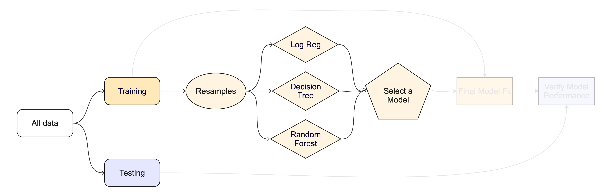
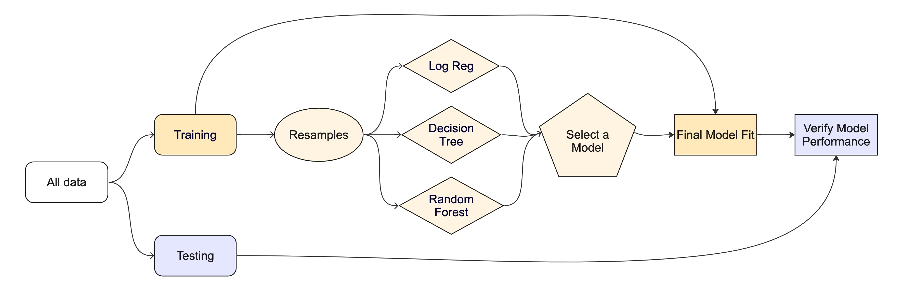

```{r setup}
#| include: false
#| file: setup.R
```

```{r}
#| label: setup-previous
#| echo: false
library(tidymodels)
library(censored)
library(splines)

data(cat_adoption)

cat_adoption <- 
  cat_adoption |> 
  mutate(event_time = Surv(time, event), .keep = "unused", .before = everything()) 

set.seed(27)
in_demo <- sample.int(nrow(cat_adoption), 50)
demo_cats <- cat_adoption |> slice(in_demo)

set.seed(123)
cat_split <- initial_split(cat_adoption |> slice(-in_demo), prop = 0.8)
cat_train <- training(cat_split)
cat_test <- testing(cat_split)

tree_spec <- decision_tree() |> 
  set_mode("censored regression")

tree_wflow <- workflow(event_time ~ ., tree_spec)

tree_fit <- tree_wflow |> 
  fit(data = cat_train) 
```

## Predictions {.annotation} 

For our demo data set of n = `r nrow(demo_cats)` cats, we'll make predictions every 30 days for roughly the first 10 months:

```{r}
#| label: demo-cat-preds
demo_cat_preds <- augment(tree_fit, demo_cats, eval_time = ((1:10) * 30))
demo_cat_preds |> select(1:3)
```

## Concordance {.annotation} 

The concordance statistic (“c-index”, [Harrell _et al_ (1996)](https://scholar.google.com/scholar?hl=en&as_sdt=0%2C7&q=%22multivariable+prognostic+models%3A+issues+in+developing+models%2C+evaluating+assumptions+and+adequacy%2C+and+measuring+and+reducing+errors%22&btnG=)) is a metric that quantifies that the rank order of the times is consistent with the model score. 

It takes into account censoring and does not depend on a specific evaluation time. The range of values is $[-1, 1]$. 

```{r}
#| label: concordance
demo_cat_preds |> 
  concordance_survival(event_time, estimate = .pred_time)
```

## Time-dependent metrics

```{r}
#| label: demo-probs-again
#| echo: false
#| fig-width: 6
#| fig-height: 4
#| out-width: 80%
#| fig-align: center
demo_cat_preds |> 
  slice(1:2) |> 
  add_rowindex() |> 
  mutate(cat = paste0("#", .row, " (", format(event_time), ")")) |> 
  unnest(.pred) |> 
  ggplot(aes(.eval_time, .pred_survival, group = cat, col = cat)) + 
  geom_point() +
  lims(x = c(0, 300), y = c(0, 1)) +
  labs(x = "Evaluation time", y = "Probability of not adopted")
```


## Classification(ish) metrics

Most dynamic metrics convert the survival probabilities to events and non-events based on some probability threshold. 

From there, we can apply existing classification metrics, such as

- Brier Score (for calibration)
- Area under the ROC curve (for separation)

More details on dynamics metrics at [tidymodels.org](https://www.tidymodels.org/learn/#category=survival%20analysis) 

## Converting to events

```{r}
#| label: plot-graf-categories
#| echo: false
#| warning: false
#| fig-width: 8
#| fig-height: 4
#| out-width: 70%
#| fig-align: center
obs_time <- c(4, 2)
obs_status <- c("censored", "event")

df1 <- tibble::tibble(
  obs_id = 1:2,
  obs_time = obs_time,
  obs_status = obs_status,
  eval_time = 1,
  eval_status = c("censored", "censored")
)
df2 <- tibble::tibble(
  obs_id = 1:2,
  obs_time = obs_time,
  obs_status = obs_status,
  eval_time = 3,
  eval_status = c("censored", "event")
)
df3 <- tibble::tibble(
  obs_id = 1:2,
  obs_time = obs_time,
  obs_status = obs_status,
  eval_time = 5,
  eval_status = c(NA, "event")
)
df <- bind_rows(df1, df2, df3)

pch_dot_empty <- 1
pch_dot_solid <- 19
pch_triangle_empty <- 2
pch_triangle_solid <- 17

df |> 
  dplyr::mutate(
    obs_status = dplyr::if_else(obs_status == "censored", pch_dot_empty, pch_dot_solid),
    eval_status = dplyr::if_else(eval_status == "censored", pch_triangle_empty, pch_triangle_solid)
  ) |> 
  ggplot() +
  geom_point(aes(obs_time, obs_id, shape = obs_status, size = I(5))) +
  geom_segment(aes(x = rep(0, 6), y = obs_id, xend = obs_time, yend = obs_id)) +
  geom_vline(aes(xintercept = eval_time, col = I("red"), linetype = I("dashed"), linewidth = I(0.8))) +
  geom_point(aes(eval_time, obs_id, shape = eval_status, col = I("red"), size = I(5))) +
  scale_shape_identity("Status",
                       labels = c("Observation: censored", "Observation: event",
                                  "Evaluation: non-event", "Evaluation: event"),
                       breaks = c(1, 19, 2, 17),
                       guide = "legend") +
  scale_x_continuous(limits = c(0, 7)) +
  scale_y_continuous(limits = c(0.5, 2.5)) +
  labs(x = "Time", y = "Sample") +
  theme_bw() +
  theme(axis.text.y = element_blank(), legend.position = "top") +
  facet_grid(~ eval_time) 
```

## Converting to events {.annotation} 

For a specific evaluation time point $\tau$, we convert the observed event time to a binary event/non-event version, if possible. 

$$
y_{i\tau} = 
\begin{cases}
0 & \text{if } \tau \lt t_{i} \text{ and } either \notag \\ 
1 & \text{if } \tau \geq t_{i} \text{ and  event} \notag \\ 
missing & \text{if } \tau \geq t_{i} \text{ and censored }
\end{cases}
$$

## Dealing with missing outcome data {.annotation} 

Without censored data points, this conversion would yield appropriate performance estimates since no event outcomes would be missing. 

<br>

Otherwise, there is the potential for bias due to missingness. 

<br>

We'll use tools from causal inference to compensate by creating a propensity score that uses the probability of being censored/missing. 

Case weights use the inverse of this probability. See [Graf _et al_ (1999)](https://scholar.google.com/scholar?hl=en&as_sdt=0%2C7&q=graf+1999+%22Assessment+and+comparison+of+prognostic+classification+schemes+for+survival+data%22&btnG=).

## Brier score

The Brier score is calibration metric originally meant for classification models:

$$
Brier = \frac{1}{N}\sum_{i=1}^N\sum_{k=1}^C (y_{ik} - \hat{\pi}_{ik})^2
$$

## Brier score

For our application, we have two classes and case weights $w_{it}$

$$
Brier(t) = \frac{1}{N}\sum_{i=1}^N w_{it} 
\left[
\begin{aligned}
    &\underbrace{I(y_{it} = 0)((1 - y_{it}) - \hat{p}_{it})^2}_\text{non-events} \\
    &+ \underbrace{I(y_{it} = 1)(y_{it} - (1 - \hat{p}_{it}))^2}_\text{events} 
\end{aligned}
\right]
$$

where $N$ is the number of non-missing rows in the data.

## Brier scores

```{r}
#| label: brier-ex
demo_brier <- brier_survival(demo_cat_preds, truth = event_time, .pred)
demo_brier
```

## Brier scores over evaluation time {.annotation} 

```{r}
#| label: brier-time
#| echo: false
#| fig-width: 6
#| fig-height: 4.25
#| out-width: 60%
#| fig-align: center
demo_brier  |> 
  ggplot(aes(.eval_time, .estimate)) + 
  geom_line() + geom_point() +
  geom_hline(yintercept = 0, col = "lightgreen") +
  labs(x = "Evaluation time", y = "Brier score")
```

## Integrated Brier Score

```{r}
#| label: brier-int-ex
brier_survival_integrated(demo_cat_preds, truth = event_time, .pred)
```

## Area Under the ROC Curve

We can use the standard ROC curve machinery on the indicators, probabilities, and censoring weights at evaluation time $\tau$.  
See [Hung and Chiang (2010)](https://scholar.google.com/scholar?hl=en&as_sdt=0%2C7&q=%22Optimal+Composite+Markers+for+Time-Dependent+Receiver+Operating+Characteristic+Curves+with+Censored+Survival+Data%22&btnG=).

<br>

ROC curves measure the separation between events and non-events and are ignorant of how well-calibrated the probabilities are.  


## Area under the ROC curve 

```{r auc-survival}
demo_roc_auc <- roc_auc_survival(demo_cat_preds, truth = event_time, .pred)
demo_roc_auc
```

## ROC AUC over evaluation time

```{r}
#| label: auc-time
#| echo: false
#| fig-width: 6
#| fig-height: 4.25
#| out-width: 60%
#| fig-align: center
demo_roc_auc |> 
  ggplot(aes(.eval_time, .estimate)) + 
  geom_line() + geom_point() +
  geom_hline(yintercept = 1, col = "lightgreen")+
  geom_hline(yintercept = 1/2, col = "indianred3")+
  labs(x = "Evaluation time", y = "ROC AUC")
```

## Setting evaluation times

- You can get predictions at any values of $\tau$. 
- During model development, we suggest picking a more focused set of evaluation times (for computational time). 
- You should also pick a single time to perform your optimizations/comparisons with and list that value first in the vector. If 90 days was of particular interest over a 30-to-120-day span, you'd use

```{r}
#| label: time-example
eval_times <- c(90, 30, 60, 120)
```


# ⚠️ DANGERS OF OVERFITTING ⚠️

## Your turn {transition="slide-in"}

{.absolute top="0" right="0" width="150" height="150"}

*Why haven't we done this?*

```{r augment-acc-2}
#| eval: false
tree_fit |>
  augment(cat_train, eval_time = ((1:10) * 30)) |>
  brier_survival(truth = event_time, .pred)
```

```{r ex-overfitting}
#| echo: false
countdown::countdown(minutes = 5, id = "overfitting")
```

::: {.notes}
- repredicting the training set is overly optimistic
- optimising that leads to overfitting
:::

# The testing data are precious 💎

# How can we use the *training* data to compare and evaluate different models? 🤔

##  {background-color="white" background-image="https://www.tmwr.org/premade/resampling.svg" background-size="70%"}

## Cross-validation `r hexes("rsample")` {.annotation} 

```{r vfold-cv}
set.seed(123)
cat_folds <- vfold_cv(cat_train, v = 10) # v = 10 is default
cat_folds
```

## Cross-validation `r hexes("rsample")`

What is in this?

```{r cat-splits}
cat_folds$splits[1:3]
```

. . .

Set the seed when creating resamples

::: notes
Talk about a list column, storing non-atomic types in dataframe
:::

## Bootstrapping `r hexes("rsample")` {.annotation} 

```{r bootstraps}
set.seed(3214)
bootstraps(cat_train)
```

##  {background-iframe="https://rsample.tidymodels.org/reference/index.html"}

::: footer
:::

## The whole game - status update

```{r diagram-resamples, echo = FALSE}
#| fig-align: "center"

knitr::include_graphics("images/whole-game-transparent-resamples.jpg")
```

# We are equipped with metrics and resamples!

## Fit our model to the resamples

```{r fit-resamples}
tree_wflow <- workflow(event_time ~ ., tree_spec)

tree_res <- fit_resamples(tree_wflow, cat_folds, eval_time = c(90, 30, 60, 120))
tree_res
```

## Evaluating model performance `r hexes("tune")` {.annotation} 

```{r collect-metrics}
tree_res |>
  collect_metrics()
```

::: notes
`collect_metrics()` is one of a suite of `collect_*()` functions that can be used to work with columns of tuning results. Most columns in a tuning result prefixed with `.` have a corresponding `collect_*()` function with options for common summaries.
:::

. . .

We can reliably measure performance using only the **training** data 🎉

## Where are the fitted models? `r hexes("tune")`  {.annotation}

```{r cat-res}
tree_res
```

. . .

🗑️

## But it's easy to save the predictions `r hexes("tune")`

```{r save-predictions}
# Save the assessment set results
ctrl_cat <- control_resamples(save_pred = TRUE)
tree_res <- fit_resamples(tree_wflow, cat_folds, eval_time = c(90, 30, 60, 120),
                          control = ctrl_cat)

tree_res
```

## But it's easy to collect the predictions `r hexes("tune")`

```{r collect-predictions}
tree_preds <- collect_predictions(tree_res)
tree_preds
```

# Decision tree 🌳

# Random forest 🌳🌲🌴🌵🌴🌳🌳🌴🌲🌵🌴🌲🌳🌴🌳🌵🌵🌴🌲🌲🌳🌴🌳🌴🌲🌴🌵🌴🌲🌴🌵🌲🌵🌴🌲🌳🌴🌵🌳🌴🌳

## Random forest 🌳🌲🌴🌵🌳🌳🌴🌲🌵🌴🌳🌵

- Ensemble many decision tree models

- All the trees vote! 🗳️

- Bootstrap aggregating + random predictor sampling

. . .

- Often works well without tuning hyperparameters (more on this in a moment), as long as there are enough trees

## Create a random forest model `r hexes("parsnip")`

```{r rf-spec}
rf_spec <- rand_forest(trees = 1000) |> 
  set_engine("aorsf") |> 
  set_mode("censored regression")
rf_spec
```

## Create a random forest model `r hexes("workflows")`

```{r rf-wflow}
rf_wflow <- workflow(event_time ~ ., rf_spec)
rf_wflow
```

## Your turn {transition="slide-in"}

{.absolute top="0" right="0" width="150" height="150"}

*Use `fit_resamples()` and `rf_wflow` to:*

-   *keep predictions*
-   *compute metrics*

```{r ex-try-fit-resamples}
#| echo: false
countdown::countdown(minutes = 8, id = "try-fit-resamples")
```

## Evaluating model performance `r hexes("tune")`

```{r collect-metrics-rf}
ctrl_cat <- control_resamples(save_pred = TRUE)

# Random forest uses random numbers so set the seed first
set.seed(2)
rf_res <- fit_resamples(rf_wflow, cat_folds, eval_time = c(90, 30, 60, 120), 
                        control = ctrl_cat)

collect_metrics(rf_res)
```

## The whole game - status update

```{r diagram-select, echo = FALSE}
#| fig-align: "center"


```

## The final fit `r hexes("tune")` 

Suppose that we are happy with our random forest model.

Let's fit the model on the training set and verify our performance using the test set.

. . .

We've shown you `fit()` and `predict()` (+ `augment()`) but there is a shortcut:

```{r final-fit}
# cat_split has train + test info
final_fit <- last_fit(rf_wflow, cat_split, eval_time = c(90, 30, 60, 120)) 

final_fit
```

## What is in `final_fit`? `r hexes("tune")`

```{r collect-metrics-final-fit}
collect_metrics(final_fit)
```

. . .

These are metrics computed with the **test** set

## What is in `final_fit`? `r hexes("tune")`

```{r extract-workflow}
extract_workflow(final_fit)
```

. . .

Use this for **prediction** on new data, like for deploying

## The whole game

```{r diagram-final-performance, echo = FALSE}
#| fig-align: "center"


```
